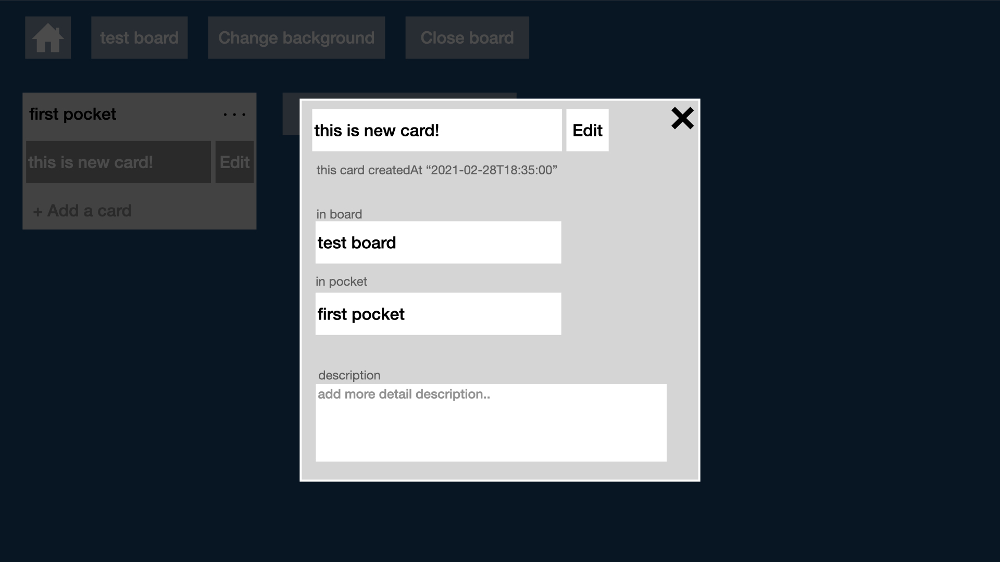

# Trello

## 토이 프로젝트 - 스프링MVC를 이용한 트렐로 만들기

### **요구사항 분석 \(4일\) - 2021년 02월 19일 부터 시작**

* **최대한 디테일 하게 작성해야 나중에 개발 할때 고민을 하지 않는다!**
* **API, input데이터, output데이터 까지 넣기**

## **요구사항 분석**

### **메인 화면**

**트렐로 메인 화면**

* **\[   \] 내가 생성했던 board들을 화면에 보여준다.**
* **\[   \] 새로운 board를 생성하려면 “Create new board” 를 클릭하면 된다.**

#### **새로운 board 생성 폼**

* **\[   \] Create new board 버튼을 클릭하게 되면 board를 생성하는 폼 화면이 나오게 된다.**
* **\[   \] 입력을 하게 되면 아래의  Create Board  버튼이 활성화가 된다. \(title을 입력하지 않으면 버튼 활성화가 되지 않는다!\)**
* **\[   \] 오른쪽 상단에 X 버튼을 클릭하면 입력 폼을 닫을 수 있다.**
* **\[   \]  Create Board  버튼 클릭을 하게 되면 해당 board를 생성함과 동시에 board 관리 화면으로 이동하게 된다. 이동 url 은 “https://trello.com/b/랜덤문자열/보드이름” 으로 이동.**

**Trello API**

[**https://developer.atlassian.com/cloud/trello/rest/api-group-boards/\#api-boards-id-get**](https://developer.atlassian.com/cloud/trello/rest/api-group-boards/#api-boards-id-get)

#### 

### **board 관리 페이지**

**\(그림 0. 메인화면\)👇**  
****

**\(그림 1.\)👇 board title 수정 가능 \[아래사진\]\)**         

  **** ****

**\(그림 2.\) 👇 +Add another list 버튼 \[아래사진\]\)**

**\(그림 3.\) 👇… show menu 를 클릭하면 나오는 화면.**  

**\(그림 3-1.\) 예시 화면 👇👇**

\*\*\*\*  
**\(예시는 list 라는 이름을 사용하고, 실제 이름으로 list 대신에 pocket으로 사용하겠습니다.\)**

**그림 0 에서**

* **\[   \] \(그림 0\) 에 보면 홈 버튼을 클릭하면, 메인화면으로 이동하게 된다.**
* **\[   \] + Add a list  버튼을 클릭하면 list 생성 폼이 나오게 된다. \(입력 폼 기능은** [**list 추가**](https://docs.google.com/document/d/1X8BunX5KyOdbFjNxJ2dvVpP15Eq5AeUk2WFr4yNqJg0/edit#heading=h.avkt6recuvq2)**에서 자세히 알아봄\)**

**그림 1 에서**

* **\[   \] board title을 클릭하면, title을 수정할 수 있다. \(엔터키로 입력해서 변경\)**
* **\[   \] title을 공백으로 제출하면, 수정이 이뤄지지 않고 입력 폼이 종료된다.** 

**그림 2 에서**

* **\[   \] list를 추가 하고 난 뒤 바로 옆에 새로 추가할 수 있는 버튼이 생긴다.** 

**그림 3 에서**

* **\[   \] \(그림 3\) 을 보면 … show menu 버튼이 있는데 여기서 change background 와 close board 버튼만 따로 밖으로 빼낼 예정이다.**

### **list\(pocket\) 관련 기능**

**\(그림 0.\) 👇Add a list 버튼 \(그림 1.\) 👇 버튼 클릭 후 나오는 list title 입력 폼**

  
****

**\(그림 2.\) 👇 list title을 클릭하면 title 수정 가능.\(enter로 수정완료\)  &   + Add another list**

**\(그림 3.\) 👇list를 잡고 Drag & Drop 으로 list 순서 변경 가능**

**그림 0 에서 -&gt; 그림 1 에서**

* **\[   \] + Add a list  를 클릭하게 되면, list title을 입력할 수 있는 폼이 나온다.**

**그림 2 에서**

* **\[   \] list의 title을 클릭하면 수정을 할 수 있습니다.**
* **\[   \] list를 추가하게 되면, 옆에 + Add another list  버튼이 생기게 된다.**

**그림 3 에서**

* **\[   \] list를 마우스로 drag & drop 하여 순서를 바꿀 수 있습니다.**

**list가 넘치는 경우**

* **\[   \] list를 여러 개 생성했을 때, 화면에 넘친 list는 scroll 기능을 사용하도록 함.**

 **일 대 다 연관관계 매핑 \( board : list \)**

* **\[   \] 하나의 board에는 여러 개의 list를 생성할 수 있습니다. 1\(board\) : 다\(list\) 연관 관계**

### **card 관련 기능**

**\(그림 0.\) list 내부에 + Add a card 버튼         \(그림 1.\) Add 버튼을 클릭하면 title을 입력하는 폼이 나온다.**

**\(그림 2.\) 마찬가지로 여러 개 카드 생성 가능 & Drag & Drop 가능**

       ****

**\(그림 3.\) 카드 클릭시 모달창이 뜨게 된다.**

**그림 0 -&gt; 그림 1**

* **\[   \]  +Add a card 버튼을 클릭하면, 카드의 title을 입력하는 폼이 나타난다.**

**그림 2 설명**

* **\[   \] 카드도 마찬가지로 Drag & Drop 하여 아래 두 가지 기능을 사용할 수 있다.**
  * **list 내부에서 할 경우 card 순서를 바꿀 수 있다.**
  * **현재 list에서 다른 list로 이동할 수 있다.**

**그림 3 설명**

* **\[   \] 해당 카드를 클릭하면, 모달 창이 뜨면서 해당 카드의 정보를 상세보기 할 수 있다.**
  * **모달 창 내부에서.**
    * **카드의 title을 클릭하면, title 수정 가능.**
    * **카드의 설명 Description 입력 란이 있음.**

**카드가 넘치는 경우**

* **\[   \] 해당 list에서 카드가 넘치는 경우 scroll 을 사용한다.**

**일 대 다 연관관계 매핑\[   \] 하나의 list에는 여러 개의 card 를 가지게 된다. 1\(list\) : 다\(card\) 연관 관계**

## **DB 설계서**

### **테이블 명세서**

### **객체 연관관계로 표현**

### **DB 관점에서 표현**

## API 정의**서**

## GET

### 전체 보드 조회

#### GET /boards

GET 요청으로 전체 보드를 조회할 수 있습니다.

#### Response Data  :

| Status Code | Data | Type | Description |
| :--- | :--- | :--- | :---: |
| 200 | boards | List | 전체 보드가 담긴 리스트 |

### 하나의 보드 조회

#### GET /boards/{board\_id}

GET 요청으로 하나의 보드를 조회할 수 있습니다.

**Path Parameters :** 

| Parameter | Description |
| :---: | :---: |
| board\_id | 조회하고 싶은 보드의 아이디 |

#### Response Data  :

| Status Code | Data | Type | Description |
| :--- | :--- | :--- | :---: |
| 200 | board | Board | 조회한 보드의 데이터 |

| Data | Type | Description |
| :--- | :--- | :--- |
| id | String | 보드 아이디 |
| title | String | 보드 타이틀 |
| pockets | List | 포켓 컬렉션 |
| position | int | 보드의 위 |

### 하나의 보드의 모든 포켓 조회

#### GET /boards/{board\_id}/pockets

GET 요청으로 해당 보드의 모든 포켓 조회할 수 있습니다.

**Path Parameters :** 

| Parameter | Description |
| :---: | :---: |
| board\_id | 조회하고 싶은 보드의 아이디 |

#### Response Data  :

| Status Code | Data | Type | Description |
| :--- | :--- | :--- | :---: |
| 200 | pockets | List | 보드의 모든 포켓이 담긴 리스트 |

### 하나의 보드의 특정 포켓 조회

#### GET /boards/{board\_id}/pockets/{pocket\_id}

GET 요청으로 보드의 포켓 하나를 조회할 수 있습니다.

**Path Parameters :** 

| Parameter | Description |
| :---: | :---: |
| board\_id | 조회하고 싶은 보드의 아이디 |
| pocket\_id | 조회하고 싶은 포켓의 아이디 |

#### Response Data  :

| Status Code | Data | Type | Description |
| :--- | :--- | :--- | :---: |
| 200 | pocket | Pocket | 조회한 포켓 데이터 |

| Data | Type | Description |
| :--- | :--- | :--- |
| id | String | 포켓 아이디 |
| boardId | String | 보드 아이디 |
| title | String | 포켓 타이틀 |
| cards | List | 카드 컬렉 |
| position | int | 포의 위치 |

### 하나의 보드의 모든 카드 조회

#### GET /boards/{board\_id}/cards

GET 요청으로 해당 보드의 모든 카드를 조회할 수 있습니다.

**Path Parameters :** 

| parameter | description |
| :---: | :---: |
| board\_id | 조회하고 싶은 보드의 아이디 |

#### Response Data  :

| 상태코드 | 데이터 변수이름 | 데이터 타입 | 데이터의 설명 |
| :--- | :--- | :--- | :---: |
| 200 | cards | List | 조회한 모든 카드가 담긴 리스트 |

### 하나의 보드의 특정 카드 상세 조회

#### GET /boards/{board\_id}/cards/{card\_id}

GET 요청으로 보드의 특정 카드의 세부사항을 조회할 수 있습니다.

**Path Parameters :** 

| parameter | description |
| :---: | :---: |
| board\_id | 조회하고 싶은 보드의 아이디 |
| card\_id | 조회하고 싶은 카드의 아이디 |

#### Response Data  :

| 상태코드 | 데이터 변수이름 | 데이터 타입 | 데이터의 설명 |
| :--- | :--- | :--- | :---: |
| 200 | card | Card | 조회한 카드의 데이터 |

| 데이터 | 데이터 타입 | 데이터의 설명 |
| :--- | :--- | :--- |
| id | String | 카드 아이디 |
| title | String | 카드 타이틀 |
| pocketId | String | 포켓 아이디 |
| position | int | 카드의 위치 |

## POST

### 보드 추가

#### POST /boards

POST 요청으로 하나의 보드를 추가할 수 있습니다.

**Request Body :**

| 데이터 변수이름 | 데이터 타입 | 데이터의 설명 |
| :--- | :--- | :---: |
| title | String | 추가할 보드의 타이틀 |

#### Response Data  :

| 상태코드 | 데이터 변수이름 | 데이터 타입 | 데이터의 설명 |
| :--- | :--- | :--- | :---: |
| 201 | board | Board | 추가한 보드 데이터 |

### 포켓 추가

#### POST /boards/{board\_id}/pockets

POST 요청으로 하나의 포켓을 추가할 수 있습니다.

**Request Body :**

| 데이터 변수이름 | 데이터 타입 | 데이터의 설명 |
| :--- | :--- | :---: |
| title | String | 추가할 포켓의 타이틀 |

#### Response Data  :

| 상태코드 | 데이터 변수이름 | 데이터 타입 | 데이터의 설명 |
| :--- | :--- | :--- | :---: |
| 201 | card | Card | 추가한 카드 데이터 |

### 카드 추가

#### POST /boards/{board\_id}/cards

POST 요청으로 하나의 카드를 추가할 수 있습니다.

**Request Body :**

| 데이터 변수이름 | 데이터 타입 | 데이터의 설명 |
| :--- | :--- | :---: |
| title | String | 추가할 카드의 타이틀 |

#### Response Data  :

| 상태코드 | 데이터 변수이름 | 데이터 타입 | 데이터의 설명 |
| :--- | :--- | :--- | :---: |
| 201 | card | Card | 추가한 카드 데이터 |

## PUT

### 보드 수정

#### PUT /boards/{board\_id}

PUT 요청으로 보드의 타이틀, 위치, 내용, 배경을 수정할 수 있습니다.

**Request Body :**

| 데이터 변수이름 | 데이터 타입 | 데이터의 설명 |
| :--- | :--- | :---: |
| title | String | 수정할 보드의 타이틀 |
| color | String | 수정할 보드의 배경 색상 |
| position | int | 수정할 보드의 위치 |
| content | .. | .. |

#### Response Data  :

| 상태코드 | 데이터 변수이름 | 데이터 타입 | 데이터의 설명 |
| :--- | :--- | :--- | :---: |
| 200 | board | Board | 수정한 보드 데이터 |

### 포켓 수정

#### PUT /boards/{board\_id}/pockets/{pocket\_id}

PUT 요청으로 포켓의 타이틀, 위치, 내용 수정할 수 있습니다.

**Request Body :**

| 데이터 변수이름 | 데이터 타입 | 데이터의 설명 |
| :--- | :--- | :---: |
| title | String | 수정할 포켓의 타이틀 |
| position | int | 수정할 포켓의 위치 |
| content | .. | .. |

#### Response Data  :

| 상태코드 | 데이터 변수이름 | 데이터 타입 | 데이터의 설명 |
| :--- | :--- | :--- | :---: |
| 200 | pocket | Pocket | 수정한 포켓 데이터 |

### 카드 수정

#### PUT /boards/{board\_id}/cards/{card\_id}

PUT 요청으로 카드의 타이틀, 위치, 내용을 수정할 수 있습니다.

**Request Body :**

| 데이터 변수이름 | 데이터 타입 | 데이터의 설명 |
| :--- | :--- | :---: |
| title | String | 수정할 카드의 타이틀 |
| position | int | 수정할 카드의 위치 |
| pocket\_id | String | 수정할 포켓 아이디 |
| .. | .. | 수정할 카드의 내용 |

#### Response Data  :

| 상태코드 | 데이터 변수이름 | 데이터 타입 | 데이터의 설명 |
| :--- | :--- | :--- | :---: |
| 200 | card | Card | 수정한 카드 데이터 |

## DELETE

### 하나의 보드 삭제하기

#### DELETE /boards/{board\_id}

DELETE 요청으로 하나의 보드를 삭제할 수 있습니다.

**Path Parameters :** 

| parameter | description |
| :---: | :---: |
| board\_id | 삭제할 보드의 아이디 |

#### Response Data  :

<table>
  <thead>
    <tr>
      <th style="text-align:left">&#xC0C1;&#xD0DC;&#xCF54;&#xB4DC;</th>
      <th style="text-align:left">&#xB370;&#xC774;&#xD130; &#xBCC0;&#xC218;&#xC774;&#xB984;</th>
      <th style="text-align:left">&#xB370;&#xC774;&#xD130; &#xD0C0;&#xC785;</th>
      <th style="text-align:center">&#xB370;&#xC774;&#xD130;&#xC758; &#xC124;&#xBA85;</th>
    </tr>
  </thead>
  <tbody>
    <tr>
      <td style="text-align:left">200</td>
      <td style="text-align:left">result</td>
      <td style="text-align:left">boolean</td>
      <td style="text-align:center">
        
&#xC131;&#xACF5; &#xC5EC;&#xBD80;

        
(true:&#xC131;&#xACF5;, false:&#xC2E4;&#xD328;)

      </td>
    </tr>
  </tbody>
</table>

### 하나의 포켓 삭제하기

#### DELETE /boards/{board\_id}/pockets/{pocket\_id}

DELETE 요청으로 하나의 포켓을 삭제할 수 있습니다.

**Path Parameters :** 

| parameter | description |
| :---: | :---: |
| board\_id | 카드가 속한 보드의 아이디 |
| pocket\_id | 삭제할 포켓의 아이디 |

#### Response Data  :

<table>
  <thead>
    <tr>
      <th style="text-align:left">&#xC0C1;&#xD0DC;&#xCF54;&#xB4DC;</th>
      <th style="text-align:left">&#xB370;&#xC774;&#xD130; &#xBCC0;&#xC218;&#xC774;&#xB984;</th>
      <th style="text-align:left">&#xB370;&#xC774;&#xD130; &#xD0C0;&#xC785;</th>
      <th style="text-align:center">&#xB370;&#xC774;&#xD130;&#xC758; &#xC124;&#xBA85;</th>
    </tr>
  </thead>
  <tbody>
    <tr>
      <td style="text-align:left">200</td>
      <td style="text-align:left">result</td>
      <td style="text-align:left">boolean</td>
      <td style="text-align:center">
        
&#xC131;&#xACF5; &#xC5EC;&#xBD80;

        
(true:&#xC131;&#xACF5;, false:&#xC2E4;&#xD328;)

      </td>
    </tr>
  </tbody>
</table>

### 하나의 카드 삭제하기

#### DELETE /boards/{board\_id}/cards/{card\_id}

DELETE 요청으로 하나의 카드를 삭제할 수 있습니다.

**Path Parameters :** 

| parameter | description |
| :---: | :---: |
| board\_id | 카드가 속한 보드의 아이디 |
| card\_id | 삭제할 카드의 아이디 |

#### Response Data  :

<table>
  <thead>
    <tr>
      <th style="text-align:left">&#xC0C1;&#xD0DC;&#xCF54;&#xB4DC;</th>
      <th style="text-align:left">&#xB370;&#xC774;&#xD130; &#xBCC0;&#xC218;&#xC774;&#xB984;</th>
      <th style="text-align:left">&#xB370;&#xC774;&#xD130; &#xD0C0;&#xC785;</th>
      <th style="text-align:center">&#xB370;&#xC774;&#xD130;&#xC758; &#xC124;&#xBA85;</th>
    </tr>
  </thead>
  <tbody>
    <tr>
      <td style="text-align:left">200</td>
      <td style="text-align:left">result</td>
      <td style="text-align:left">boolean</td>
      <td style="text-align:center">
        
&#xC131;&#xACF5; &#xC5EC;&#xBD80;

        
(true:&#xC131;&#xACF5;, false:&#xC2E4;&#xD328;)

      </td>
    </tr>
  </tbody>
</table>

## 화면 설계서

### 메인화면

### 보드 추가 화면

### 보드 추가된 화면

### 보드 관리페이지 화면

### 포켓 추가 화면

### 포켓 추가된 화면

### 카드 추가 화면

### 카드 추가된 화면

### 카드 상세보기 화면

### 배경 색상 변경 화면

### 보드 삭제 화면

